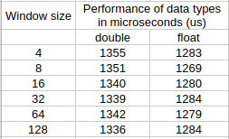
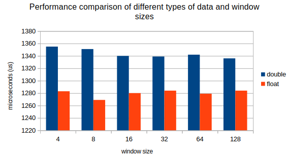

# Moving Average (A test task for a candidate)

### Introduction
The _MovingAverage_ finds the average value within the defined window size.
Supported window sizes are:
- 4
- 8
- 16
- 32
- 64
- 128

Possible types of values:
- `float`
- `double`

Maximum number of values - 1.000.000

The _MovingAverage_ project is built upon:
- `C++14` + `STL` (compiled with `Clang 18.1.8 x86_64-pc-linux-gnu`)
- `Cmake`
- `Git`

### How to run
```bash
cd MovingAverageProject
cmake -S . -B build/ && cmake --build build
./build/moving_average
```

### Measurements
##### Comparison table



##### Comparison chart


